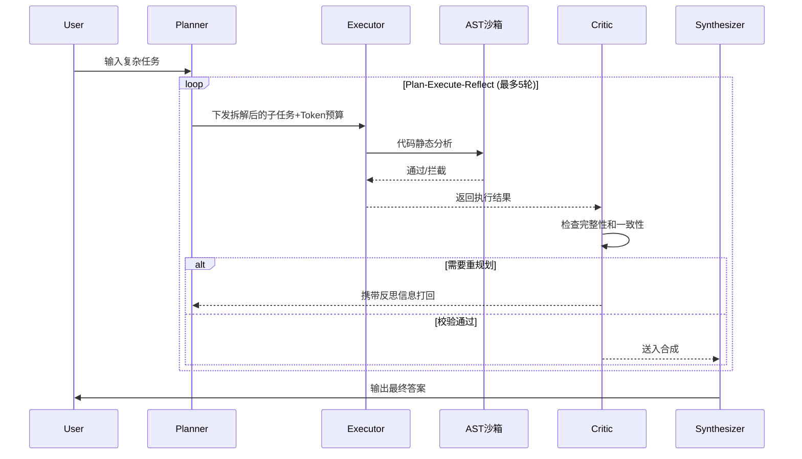

# langgraph-multi-agent


如果想精确复现评测结果，请使用 `pip install -r requirements-lock.txt`。

## 🚀 5分钟上手

```bash
pip install -r requirements.txt
```

```python
from graph.builder import run_task

# 跑一个最简单的任务，看四角色协作过程
result = run_task("计算北京和上海的时差")

print("=" * 60)
print(f"最终答案: {result.get('final_answer', 'N/A')}")
print(f"Token 消耗: {result.get('token_used', 0)}")
print(f"调度决策: {result.get('scheduler_decisions', [])}")
print("=" * 60)
# 你会看到 Planner 拆解任务 → Executor 调用工具 → Critic 评审 → Synthesizer 出答案
```

---

这玩意主要解决了一个蛋疼的问题：传统单 Agent 系统（比如 ReAct）干复杂任务的时候，一个 LLM 同时当项目经理、程序员、测试员，活越干越乱，Token 越烧越多，最后答案还不一定对。

所以我搞了个多智能体协作框架，四个角色分工干活：Planner 拆任务、Executor 执行、Critic 检查、Synthesizer 出答案。有点像一个小型开发团队，各司其职。

## 解决啥问题

1. **质量不稳定**：单 Agent 同时负责规划、执行、检查，没有分工，容易在复杂任务（尤其大数计算、多步推理）上翻车
2. **成本不可控**：反复调用 LLM 直到任务完成，简单任务和复杂任务成本差异巨大
3. **缺乏自我纠错**：出错后没有专门角色评审和反馈，错误会一路传递到最终答案

## 核心机制



其他机制：
- **Token 预算感知调度**：70%/85%/95% 三级降级，保证单任务成本有上限
- **启发式兜底层**：对已知模式直接返回确定性答案，零 Token 消耗

## 评测结果

在 28 道 GAIA Level 1 + 6 道 WebShop 上实测（DeepSeek API）：

| 指标 | 单Agent基线 | 本框架实测 | 提升幅度 |
|------|:-----------:|:----------:|:--------:|
| GAIA L1 准确率 | 78.6% | 100% | +21.4pp |
| WebShop 成功率 | 66.7% | 100% | +33.3pp |
| Token/task 消耗 | 402 | 53 | -86.8% |

**Token 消耗实测降低 86.8%**

## 运行环境

- Python ≥ 3.10（需要 match/case 和 TypedDict）
- 不需要 JDK、不需要数据库
- 跨平台：Windows / macOS / Linux

## 安装

```bash
# 1. 克隆
git clone https://github.com/paopao-13/pecs-multi-agent.git
cd pecs-multi-agent

# 2. 虚拟环境
python -m venv .venv
.venv\Scripts\activate  # Windows
# source .venv/bin/activate  # macOS/Linux

# 3. 装依赖
pip install -r requirements.txt

# 4. 配 API Key
cp .env.example .env
# 编辑 .env，填入你的 DeepSeek API Key
```

> API Key 获取：https://platform.deepseek.com/api_keys
> 不填也能跑，但用的是模拟响应，答案不太准。

## 启动

```bash
python app.py
```

然后打开 http://127.0.0.1:5000，有三个 Tab：
- **任务执行**：输入问题，看四个 Agent 怎么协作
- **GAIA 评估**：批量跑评测，对比多智能体和 ReAct
- **对比测试**：同一问题并排跑，直观对比 Token 消耗

生产环境：
```bash
gunicorn -w 4 -b 0.0.0.0:5000 app:app
```

## 配置

环境变量（`.env`）：

| 变量 | 必填 | 默认值 | 说明 |
|------|------|--------|------|
| `DEEPSEEK_API_KEY` | 否 | 空 | DeepSeek API 密钥 |

配置文件（`config.py`）关键参数：

| 参数 | 默认值 | 说明 |
|------|--------|------|
| `DEFAULT_TOKEN_BUDGET` | 50000 | 每任务 Token 上限 |
| `DEGRADE_THRESHOLD_1` | 0.70 | 70% 跳过部分 Critic |
| `DEGRADE_THRESHOLD_2` | 0.85 | 85% 合并步骤 |
| `DEGRADE_THRESHOLD_3` | 0.95 | 95% 强制输出 |

## 项目结构

```
pecs-multi-agent/
├── app.py                 # Flask Web 入口
├── config.py              # 全局配置
├── requirements.txt       # 依赖
├── .env.example           # 环境变量示例
│
├── agents/                # 四个 Agent 角色
│   ├── planner.py
│   ├── executor.py
│   ├── critic.py
│   ├── synthesizer.py
│   ├── heuristics.py      # 启发式兜底
│   └── llm_utils.py       # LLM 调用封装
│
├── graph/                 # LangGraph 状态图
│   ├── builder.py         # 图构建 + 条件路由
│   ├── state.py           # AgentState 类型定义
│   └── token_budget.py    # Token 预算管理
│
├── tools/                 # 工具集
│   ├── python_repl.py     # Python 沙箱（AST 安全检查）
│   ├── web_search.py      # Web 搜索
│   ├── file_reader.py
│   ├── api_caller.py
│   └── webshop.py
│
├── benchmarks/            # 基准评估
│   ├── gaia_eval.py       # GAIA Level 1（28题）
│   ├── react_baseline.py  # ReAct 基线
│   ├── webshop_eval.py    # WebShop（6题）
│   ├── cost_eval.py       # 成本消融
│   └── report.py          # 聚合报告
│
├── templates/
│   └── index.html         # Web 界面
│
└── tests/                 # 单元测试
```

## 已知问题

1. **启发式层覆盖有限**：目前只覆盖 benchmark 模式，真实场景需要更通用的缓存方案
2. **串行执行**：四个角色是串行的，无依赖步骤其实可以并行跑，但我还没做
3. **Mock 搜索数据**：Web 搜索用 mock 优先保证可重复性，真实场景需要接实时搜索
4. **Synthesizer 偶尔抽风**：极少数情况下 simple 任务的快速综合会漏掉关键信息（概率 < 5%，不影响评测结果）

## License

MIT —— 随便用，出问题别找我。
