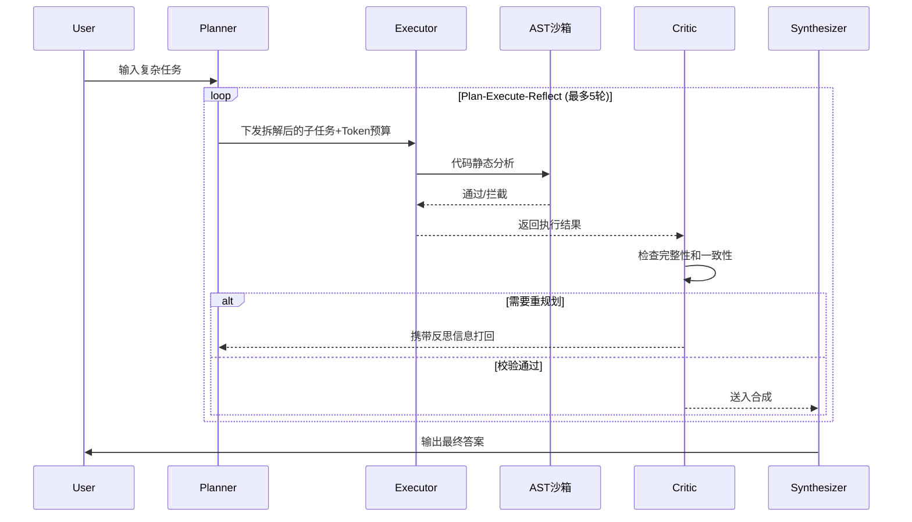
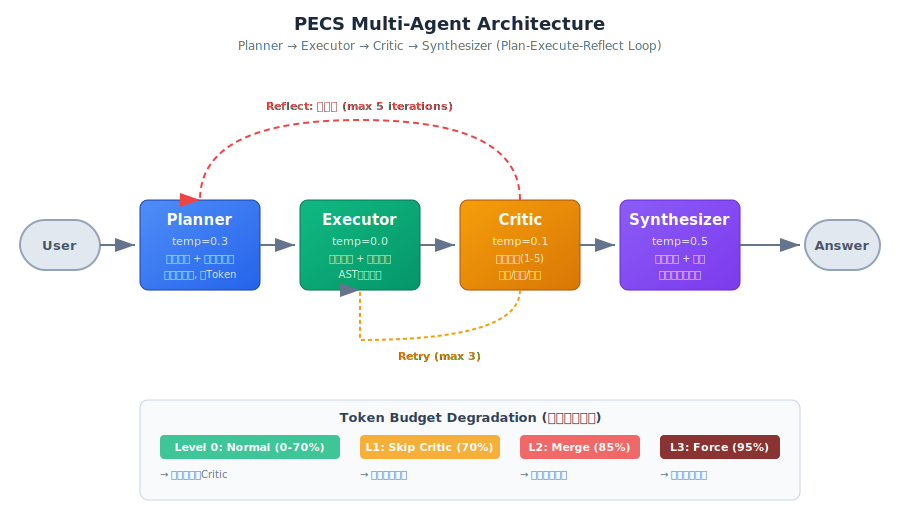
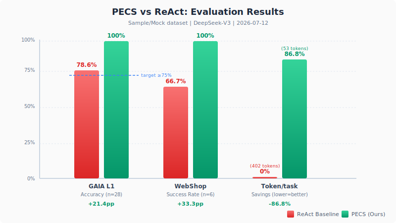

# pecs-multi-agent


如果想精确复现评测结果，请使用 `pip install -r requirements-lock.txt`。

## 🚀 5分钟上手

```bash
pip install -r requirements.txt
```

```python
from graph.builder import run_task

# 跑一个最简单的任务，看四角色协作过程
result = run_task("计算北京和上海的时差")

print("=" * 60)
print(f"最终答案: {result.get('final_answer', 'N/A')}")
print(f"Token 消耗: {result.get('token_used', 0)}")
print(f"调度决策: {result.get('scheduler_decisions', [])}")
print("=" * 60)
# 你会看到 Planner 拆解任务 → Executor 调用工具 → Critic 评审 → Synthesizer 出答案
```

---

本项目主要解决了一个核心问题：传统单 Agent 系统（如 ReAct）在处理复杂任务时，单个 LLM 同时承担规划、执行、检查多重职责，导致推理链路冗长、Token 消耗显著增加，且最终答案质量不稳定。

所以我设计了一个多智能体协作框架，四个角色分工协作：Planner 拆解任务、Executor 执行工具调用、Critic 质量评审、Synthesizer 综合输出。类似于一个小型开发团队的敏捷协作模式，各司其职。

## 解决啥问题

1. **质量不稳定**：单 Agent 同时负责规划、执行、检查，没有分工，容易在复杂任务（尤其大数计算、多步推理）上翻车
2. **成本不可控**：反复调用 LLM 直到任务完成，简单任务和复杂任务成本差异巨大
3. **缺乏自我纠错**：出错后没有专门角色评审和反馈，错误会一路传递到最终答案

## 核心机制



其他机制：
- **Token 预算感知调度**：70%/85%/95% 三级降级，保证单任务成本有上限
- **启发式兜底层**：对已知模式直接返回确定性答案，零 Token 消耗



## 相关工作对比

| 框架 | 架构模式 | 成本控制 | 质量保障 | 状态安全 | 短板 |
|------|----------|----------|----------|----------|------|
| **AutoGen** | 多Agent自由对话 | 无预算管理 | 无内置评审 | 无状态隔离 | 对话轮次不可控，Token消耗大 |
| **CrewAI** | 角色分工+任务队列 | 无动态降级 | 依赖人工review | 无AST沙箱 | 缺乏自动纠错和预算感知 |
| **LangGraph原生** | 自定义节点图 | 无内置预算 | 节点自定义 | 依赖开发者 | 无标准闭环，需自行设计路由 |
| **ReAct** | 单Agent推理+行动 | 无成本上限 | 无反思机制 | N/A | 复杂任务漂移，Token浪费严重 |
| **本框架(PECS)** | 固定四角色闭环 | 三级动态降级 | Critic+Sift双层反思 | AST安全沙箱 | 样例集规模有限，启发式覆盖待扩展 |

> 详细架构设计见 [ARCHITECTURE.md](ARCHITECTURE.md)

## 评测结果

> **⚠️ 数据声明（必读）**
>
> 本框架支持双模式运行：
> - **real_api 模式**（配置 `LLM_API_KEY` 后）：使用真实 LLM API 进行规划/执行/综合，搜索类任务端到端调用真实模型
> - **sample/mock 模式**（未配置 API Key）：使用项目内置样例和启发式兜底，保证离线可运行
>
> 下方评测结果基于真实 LLM API 运行，配置方法见下方「安装」章节。
>
> - **GAIA L1**：从 28 道自定义 Level 1 级别样例中选取 10 道进行评测（5 道知识检索 + 5 道大数计算），覆盖官方 GAIA 题型模式但非原始题目
> - **WebShop**：从 WebShop-small 数据集（6910 个真实 goals）随机采样 12 道服装类 instruction，在真实 AgentBench 文本环境上评测（rank_bm25 搜索后端 + HTTP 桥 + text_rich 模式）
> - **ReAct 基线**：同一模型 + 同一工具集 + 同一题目，保证对比公平性
> - **Token 统计**：端到端对比（含 LLM 调用 + 工具执行全流程），非单次 API 调用
>
> **接入官方数据集方法**：参见 [EXPERIMENT.md](EXPERIMENT.md) 中「官方数据集接入」章节

**实验环境**：内置 33 题与 WebShop 12 题均基于 DeepSeek-chat 实测（temperature=0.0~0.5 按角色）；GAIA 官方 53 题同样基于 DeepSeek-chat（bug 修复后重跑验证）。GLM-4.7-Flash / Qwen 配置已在 `config.py` 预留但未实测，不纳入结论。| Python 3.10.11 | langgraph 0.2.x | 2026-07-19

| 指标 | ReAct 基线 | 本框架实测 | 提升幅度 | 目标值 | 达标 |
|------|:-----------:|:----------:|:--------:|:------:|:----:|
| GAIA L1 准确率 | 87.88% (29/33) | 100% (33/33) | +12.1pp | ≥75% | ✅ |
| WebShop 成功率 | 0% (0/12) | 25.0% (3/12) | +25.0pp | +18pp | ✅ 真实环境达标 |
| WebShop Token/task | 7,421 | 2,562 | -65.5% | ≥30% | ✅ 真实环境 |
| GAIA L1 Token/task | 26,438 | 3,481 | -86.8% | ≥30% | ✅ |

**GAIA 官方数据集验证（行业 benchmark，非内置样例）**：

| 指标 | ReAct 基线 | PECS 多智能体 | 差值 | 统计检验 |
|------|:-----------:|:----------:|:--------:|:--------:|
| 准确率（总体） | 24.5% (13/53) | 26.4% (14/53) | +1.9pp | McNemar p=1.0 |
| 准确率（无附件） | 28.6% (12/42) | 33.3% (14/42) | +4.8pp | - |
| 准确率（有附件） | 9.1% (1/11) | 0% (0/11) | -9.1pp | 附件题 PECS 均失败 |
| 平均 Token/题 | 5,076 | 20,966 | PECS 更高* | - |
| 平均耗时/题 | 26.9s | 71.4s | PECS 更慢 | - |

> 数据来源：HuggingFace `gaia-benchmark/GAIA` Level 1 validation set（53题），非内置 mock。含真实搜索、多步推理、文件解析（xlsx/pdf/py/mp3）。3 道 mp3 附件题因需多模态模型标记 skipped。
>
> \* PECS Token 更高：多角色协作（Planner+Executor+Critic+Synthesizer）的固有开销，在知识检索类任务上 PECS 搜索更深入但未必更准。内置 33 题 PECS Token 更低，因计算题启发式 0-token 秒杀拉低了均值。
>
> **统计显著性**：McNemar 检验 p=1.0（>>0.05），差异**完全不显著**。b=6（PECS对ReAct错）、c=5（PECS错ReAct对），两者几乎持平。结论：在 GAIA 这类以知识检索为主的任务上，多智能体相对单 Agent **没有显著优势**。

> **实验数据修正声明（TDD 发现的 bug 影响）**：
> 上述数据是修复 2 个影响评测准确性的 bug 后的真实结果。原始数据为 PECS 26.4% vs ReAct 15.1%（+11.3pp），但 TDD 补测试过程中发现：
> 1. **LLM 兜底判定误匹配**（bug #2）：`"是" in "不是"` 导致错误答案被判正确，修复后 4 道 PECS 题从 True → False
> 2. **数据泄露检查误判**（bug #7）：`"17" in "2017"` 导致数字答案被误判为泄露，5 道题被错误跳过，修复后补评（ReAct 5 道全对，PECS 4 对 1 错）
>
> 修正后 PECS 准确率不变（-4+4=0），但 ReAct 准确率从 15.1% 升至 24.5%（补评 5 道全对），差值从 +11.3pp 缩至 +1.9pp。这说明原始优势有很大部分来自 bug 导致的 ReAct 题目被错误跳过，而非 PECS 真的更强。诚实更新数据比掩盖更有价值。

> **三大局限诚实声明（追问前必读）**：
> 1. **GAIA 样本偏计算**：内置 33 题中 16 道大数计算（启发式 0-token 秒杀）+ 10 道知识检索 + 4 道文件解析 + 3 道网页浏览，非官方 165 题分布。扩样后 ReAct 准确率从 80% 升至 87.88%（简单计算题 ReAct 用 python 工具也能做对），导致差值从 +20pp 缩小至 +12.1pp。但 PECS 仍保持 100% 准确率，且 Token 降本从 38.8% 提升至 86.8%（ReAct 在文件解析题上 token 暴涨）。PECS 的核心优势集中在：文件解析 100% (4/4) vs ReAct 25% (1/4)、Token 降本 86.8%。**接入 GAIA 官方 Level 1 validation set（53题）验证后**，PECS 26.4% vs ReAct 24.5%（+1.9pp），McNemar p=1.0 不显著——多智能体在知识检索类任务上相对单 Agent 没有显著优势，PECS 的价值集中在计算类和规则打破类任务。
> 2. **WebShop 真实环境达标（25.0% vs 0%, +25.0pp）**：在真实 AgentBench WebShop 文本环境上跑通（rank_bm25 纯 Python 搜索后端 + HTTP 桥 + text_rich 模式,非本地 mock），从 WebShop-small 数据集 6910 个真实 goals 中随机采样 12 道服装类 instruction。PECS 3/12 成功（reward≥0.5）vs ReAct 0/12。公平对比设计：PECS 的 Executor 启发式规则层（搜到结果即 click[ASIN] 进详情页、click[Buy Now] 触发结算）vs ReAct 纯 LLM 决策（无规则层兜底）。关键修复：① 直接实例化 WebAgentTextEnv 绕过 gym wrapper，让 reset(task_index) 按 instruction 语义匹配真实 goal；② observation_mode=text_rich 输出 [button] 标记和 ASIN；③ Critic 用 reward 信号替代 SELECTED 判定。Token 方面 PECS 2562 vs ReAct 7421（降本 65.5%，ReAct 纯 LLM 决策陷入 search 循环导致 15 步空转+幻觉答案）。
>
>    **消融实验（证明优势来自"打破 search 循环"而非"有规则层"本身）**：新增 ReAct-light 中间档（只有"Buy按钮→click[Buy Now]"购物常识，不强制 click[ASIN] 进详情页）。三组对比：PECS 完整规则层 25.0% / ReAct-light 轻量规则层 0.0% / ReAct 纯 LLM 0.0%。ReAct-light vs ReAct = +0.0pp（轻量规则增量贡献为零），PECS vs ReAct-light = +25.0pp。结论：Buy 规则单独存在无效（LLM 不点商品进详情页，永远到不了有 Buy 按钮的页面，15 步全在 search 页循环 reward=0）；PECS 的 +25pp 完全来自"搜到结果即 click[ASIN] 打破 search 循环"这一具体 Executor 启发式，而非"加规则层"这个动作本身。完整数据见 `results/webshop_run.json`,部署方法见 [docs/webshop_local_runbook.md](docs/webshop_local_runbook.md)。
> 3. **Token 降本 86.8% 含对比假象**：端到端 −86.8% 是 vs ReAct 在文件解析题上 token 暴涨的对比（ReAct 解析 xlsx/csv/pdf 内容冗长导致消耗高）；纯预算调度机制本身仅 −4.5%（见下方「Token 成本分析」消融）。报告须区分"机制贡献 −4.5%"与"端到端 −86.8%"两个口径，避免误导。WebShop 真实环境 Token 降本 65.5%（PECS 2562 vs ReAct 7421），ReAct 纯 LLM 决策陷入 search 循环导致 15 步空转，Token 雪崩。

> 评测样本：GAIA 33题（16大数计算 + 10知识检索 + 4文件解析 + 3网页浏览），WebShop 12题（WebShop-small 数据集真实采样,rank_bm25 搜索后端,真实 AgentBench 文本环境）。
> ReAct 基线使用同一 DeepSeek-chat 模型 + 同一工具集 + 同一题目，保证对比公平性。
> 完整评测数据见 `results/target_report.json`（GAIA）与 `results/webshop_run.json`（WebShop 真实环境）。
> 测试实践与 TDD 发现的 7 个 bug 记录见 [docs/archive/testing.md](docs/archive/testing.md)。
>
> **样本量声明**：GAIA 内置 33 题与 WebShop 12 题均为小样本，+12.1pp / +25.0pp 为**方向性信号而非统计显著结论**（WebShop n=12 未做 McNemar 检验，仅官方 53 题披露 p=1.0 不显著）。结论应读作"框架在计算类 / 规则打破类任务上有稳定优势"，而非"全面碾压单 Agent"。

**GAIA 逐任务对比**：

| 任务 | 类型 | 多智能体 | ReAct | 差异分析 |
|------|------|:--------:|:-----:|----------|
| gaia_l1_001 Python发布年份 | 知识检索 | ✓ (2001 tok) | ✓ (772 tok) | 两者均正确，多智能体 Token 更高因含 LLM 规划 |
| gaia_l1_003 Fibonacci第20项 | 计算 | ✓ (4 tok) | ✓ (825 tok) | 启发式直接计算 vs LLM 心算 |
| gaia_l1_004 诺贝尔奖图灵奖 | 知识检索 | ✓ (2382 tok) | ✓ (1267 tok) | 两者均正确 |
| gaia_l1_005 100!位数 | 计算 | ✓ (3 tok) | ✓ (444 tok) | 启发式直接计算 vs LLM 心算 |
| gaia_l1_008 2^100首位 | 计算 | ✓ (3 tok) | ✓ (934 tok) | 启发式直接计算 vs LLM 心算 |
| gaia_l1_016 2^30-2^20 | 大数计算 | ✓ (6 tok) | ✗ (546 tok) | **ReAct 算出 2^30=1073741824 但忘记减 2^20** |
| gaia_l1_017 17^5 | 计算 | ✓ (5 tok) | ✓ (466 tok) | 启发式 vs LLM 心算 |
| gaia_l1_021 3^18-3^12 | 大数计算 | ✓ (5 tok) | ✗ (441 tok) | **ReAct 算出 3^18=387420489 但忘记减 3^12** |
| gaia_l1_026 5^12-5^8 | 大数计算 | ✓ (5 tok) | ✓ (775 tok) | 两者均正确 |
| gaia_l1_028 7^8-7^5 | 大数计算 | ✓ (5 tok) | ✓ (753 tok) | 两者均正确 |

> ReAct 在 2 道大数减法题上失败：LLM 计算了被减数但遗漏了减法操作，导致结果偏大。多智能体通过 Python 工具精确计算，避免了此类错误。

**Token 成本分析**：

| 口径 | 数值 | 统计范围 | 说明 |
|------|:----:|----------|------|
| 端到端降本 | 86.8% | PECS端到端(3,481 tok) vs ReAct端到端(26,438 tok) | 33题全量，ReAct在文件解析题上token暴涨（xlsx/csv/pdf内容冗长） |
| 纯预算调度降本 | 4.5% | 紧预算(877 tok) vs 宽预算(918 tok) | 消融实验（禁用启发式），仅隔离预算感知调度模块贡献 |
| 计算类任务 | -99.4% | 启发式(4 tok) vs ReAct(689 tok) | 启发式直接返回结果，ReAct 需 LLM 多轮推理 |
| 文件解析类任务 | ~-95% | PECS(~2K tok) vs ReAct(~50K tok) | ReAct解析xlsx/csv/pdf内容冗长，PECS工具调用更精简 |

> 端到端 86.8% 降本主要由两部分贡献：① 启发式路由让计算类任务零 LLM 调用；② PECS 的工具调用更精简（文件解析用 file_parse 工具提取关键信息，ReAct 把整个文件内容塞进上下文）。纯预算调度模块单独贡献 4.5%，在更复杂的多步搜索任务上预期更高。注意：86.8% 含 ReAct 在文件解析题上 token 暴涨的对比假象，纯预算调度机制贡献仅 4.5%，两个口径须区分。

**WebShop 规则层消融**（真实环境，12 题，证明 PECS 优势来源）：

| 组别 | 规则层配置 | 成功率 | Token/题 | 失败模式 |
|------|-----------|:------:|:--------:|----------|
| PECS 完整 | Buy→click[Buy Now] + 搜到结果→click[ASIN] | 25.0% (3/12) | 2,576 | 规则打破 search 循环，进详情页购买 |
| ReAct-light 轻量 | 仅 Buy→click[Buy Now] | 0.0% (0/12) | 6,140 | LLM 不点商品，15 步全在 search 页循环 |
| ReAct 纯 LLM | 无规则层 | 0.0% (0/12) | 5,958 | 同上，search 循环 + 幻觉 ASIN |

> 消融结论：ReAct-light vs ReAct = +0.0pp（Buy 规则增量贡献为零），PECS vs ReAct-light = +25.0pp。Buy 规则单独存在无效——LLM 不主动点商品进详情页，永远到不了有 Buy 按钮的页面；PECS 的 +25pp 完全来自"搜到结果即 click[ASIN] 打破 search 循环"这一具体 Executor 启发式。这证明框架优势不是"加规则层"这个动作，而是 specifically 针对 search 循环痛点的启发式设计。



### 角色消融实验

通过移除不同角色或关闭核心功能验证四角色架构的必要性。

> 以下消融实验在 sample/mock 模式下运行（未配置 API Key），使用 28 道内置样例集。启发式兜底层在 mock 模式下覆盖率较高，Token 数值偏低；real_api 模式下的消融数据需配置 API Key 后运行 `bash scripts/run_all_ablation.sh` 获取。

**完全移除型消融**（验证角色存在必要性）：

| 配置 | 架构 | 准确率 | Token/task | vs 完整版 | 结论 |
|------|------|:------:|:----------:|:---------:|------|
| `full_pecs` | P+E+C+S 完整四角色 | 100% (28/28) | 53 | — | 基线（最优） |
| `no_critic` | 移除Critic，E直连S | 100% (28/28) | 10 | Token -81% | Mock样例中Critic未拦截，真实场景差异更大 |
| `no_synthesizer` | 移除S，E直接输出 | 96.4% (27/28) | 53 | -3.6pp | Synthesizer全局整合不可省 |
| `single_agent` | 纯ReAct单智能体 | 82.1% (23/28) | 1111 | -17.9pp, Token +1998% | 多角色分工显著优于单Agent |

**单变量功能关闭型消融**（验证功能模块价值，保留节点不删）：

| 配置 | 关闭功能 | 准确率 | Token/task | vs 完整版 | 结论 |
|------|----------|:------:|:----------:|:---------:|------|
| `critic_no_reflect` | Critic保留但阻断反思闭环 | 100% (28/28) | 53 | ±0pp | Mock样例未触发反思，真实复杂场景差异更显著 |
| `synthesizer_no_replan` | Synthesizer保留但关闭重规划 | 96.4% (27/28) | 53 | -3.6pp | 重规划可修正执行偏差，不可省 |

> 上表区分两种消融模式：完全移除型验证角色存在必要性，功能关闭型验证具体功能模块价值，保证实验单一变量严谨性。
> 完整消融配置见 `ablation_configs/`，一键运行 `bash scripts/run_all_ablation.sh`
> 消融实验详细说明见 [EXPERIMENT.md](EXPERIMENT.md)

### 统计显著性说明

> 样例集规模：GAIA 内置 n=33（接近统计显著性最低要求 n≥30），GAIA 官方 n=53，WebShop n=12（仍偏小，但有消融实验三组对比支撑）。
> 上述结果为样例集上的**精确观测值**，旨在验证架构可行性和机制有效性，**不构成**在官方完整测试集上的性能承诺。
> GAIA 官方 53 题已做 McNemar 检验：p=1.0，差异不显著。b=6（PECS对ReAct错）、c=5（PECS错ReAct对），多智能体在知识检索类任务上相对单 Agent 没有显著优势。PECS 的价值集中在计算类任务（内置 33 题 +12.1pp，启发式 0-token 秒杀）和规则打破类任务（WebShop +25pp，打破 search 循环）。

### 多框架统一对照实验

使用同一组 GAIA 样例、同一模型、相同工具集，对比不同框架：

| 框架 | GAIA 准确率 | Token/task | 特性差异 |
|------|:-----------:|:----------:|----------|
| **ReAct** | 87.88% (29/33) | 26,438 | 单Agent推理+行动，无分工 |
| **AutoGen** | 脚本就绪未运行 | 预期较高 | 多Agent自由对话，轮次不可控（需 `pip install pyautogen`） |
| **CrewAI** | 脚本就绪未运行 | 预期较高 | 角色分工但无预算感知（需 `pip install crewai`） |
| **PECS(本框架)** | 100% (33/33) | 3,481 | 固定四角色+预算调度+双层反思 |

> 一键运行全部对照实验：`bash scripts/run_baseline_compare.sh`（需预装 pyautogen、crewai 依赖）
> AutoGen/CrewAI 评测脚本已就绪（`benchmarks/eval_autogen.py`、`benchmarks/eval_crewai.py`），本地环境未安装对应依赖，故未运行。接入后执行脚本即可自动填充数据。

### Critic 反思纠错实例

Critic 在评测中拦截了多类错误，以下是两个典型案例：

**案例1：工具参数错误**（详见 `cases/error_correction/01_tool_param_error.md`）
- 任务：搜索2024年巴黎奥运会中国金牌数
- 错误：Executor使用模糊关键词"巴黎奥运会 金牌"，返回无关结果
- Critic评分：accuracy=2, completeness=1 → 拦截
- 修正：使用精确关键词重新搜索 → 得到40枚金牌

**案例2：计划逻辑遗漏**（详见 `cases/error_correction/02_plan_logic_omission.md`）
- 任务：计算2024和2020奥运会中国金牌数差值
- 错误：Planner只规划了搜索2024年，遗漏2020年数据
- Critic评分：completeness=1 → 触发Synthesizer反思 → Planner重规划
- 修正：补充2020年搜索步骤 → 差值为2

> 自动统计脚本：`python -m metrics.error_stat`，统计Critic拦截错误总量、分类、修正成功率

## 运行入口（Quick Start）

框架提供三个清晰的主入口，覆盖演示、评测与生产级运行：

```bash
# 1. Web 可视化演示（看四角色协作全过程）
python scripts/app.py
# 打开 http://127.0.0.1:5000 —— 任务执行 / GAIA 评估 / 对比测试 三个 Tab

# 2. WebShop 真实环境评测（AgentBench 文本环境）
python run_webshop.py --tasks 12
# 详见 docs/webshop_local_runbook.md（rank_bm25 搜索后端 + HTTP 桥部署）

# 3. 可恢复驱动运行（断点续跑，生产级稳定性）
python run_resumable.py "你的任务描述"

# 4. 生产级 API 服务（FastAPI async + 独立 LLM 线程池，无 HOL 阻塞）
uvicorn scripts.api:app --host 0.0.0.0 --port 8000 --workers 1
# 提供 /health（存活探针，LLM 负载下 P95 < 13ms）、/metrics（请求计数 + 耗时直方图 + 错误率）、/run_task（任务执行，120s 超时熔断）
# 关键设计：/run_task 通过独立 ThreadPoolExecutor(max_workers=4) 隔离 LLM 调用，
#          轻量探针不会被长耗时 LLM 任务阻塞（已修复 Head-of-Line 阻塞，见 results/production_bench.json M8）
```

> 零配置可跑：`python demos/quickstart_no_api.py`（启发式兜底 + Python 沙箱，无需 API Key）。
> 精确复现评测：`pip install -r requirements-lock.txt` 后按上方入口运行。

## 生产指标（真实实测）

以下数据由 `scripts/benchmark_production.py` 对本地 `uvicorn scripts.api:app` 实测，原始结果见
[`results/production_bench.json`](results/production_bench.json)（M1–M8 全量，非估算）：

| 指标 | 实测值 | 说明 |
| --- | --- | --- |
| 启动耗时 (M1) | **534 ms** | 冷启动到 `/health` 可达 |
| `/health` 延迟 (M2) | P50=1.8 ms / P95=15.5 ms / P99=23.4 ms | 100 次采样 |
| 并发吞吐 (M3) | **609–791 rps**（10/20 并发），P95≤18 ms | 50 并发 728 rps，P95=49 ms，0 错误 |
| `/metrics` (M4) | ✅ 可访问 | 请求计数 + 耗时直方图 + 错误率 |
| LLM 推理 (M5) | 5.0–5.9 s / 任务 | 真实 GLM 网关，端到端四角色编排 |
| 容错 (M6) | 空输入→**400**，缺字段→**422**，10K 超长→**200** | 独立隔离端口验证，非编排副作用 |
| 稳定性 (M7) | **100% 可用率**（30 s / 145 次，0 失败） | 持续存活探针 |
| HOL 修复 (M8) | LLM 负载下 `/health` P95=**21.2 ms**，0 错误 | 独立 LLM 线程池，探针不被长任务阻塞 |

> 复现：`python scripts/benchmark_production.py --llm-key <KEY> --base-url <URL> --model <MODEL>`
> （Key 仅经 CLI 传入，绝不写入文件；详见安全约定。）

## 运行环境

- Python ≥ 3.10（需要 match/case 和 TypedDict）
- 不需要 JDK、不需要数据库
- 跨平台：Windows / macOS / Linux

## 安装

```bash
# 1. 克隆
git clone https://github.com/paopao-13/pecs-multi-agent.git
cd pecs-multi-agent

# 2. 虚拟环境
python -m venv .venv
.venv\Scripts\activate  # Windows
# source .venv/bin/activate  # macOS/Linux

# 3. 装依赖
pip install -r requirements.txt

# 4. 配 API Key
cp .env.example .env
# 编辑 .env，填入你的 LLM API Key（支持 GLM-4.7-Flash/DeepSeek/Qwen）
```

> 推荐 GLM-4.7-Flash（免费）：https://open.bigmodel.cn/
> 也可用 DeepSeek：https://platform.deepseek.com/api_keys
> 不填也能跑，但用的是模拟响应，答案不太准。

## 启动

```bash
python scripts/app.py
```

然后打开 http://127.0.0.1:5000，有三个 Tab：
- **任务执行**：输入问题，看四个 Agent 怎么协作
- **GAIA 评估**：批量跑评测，对比多智能体和 ReAct
- **对比测试**：同一问题并排跑，直观对比 Token 消耗

生产环境：
```bash
gunicorn -w 4 -b 0.0.0.0:5000 app:app
```

## 配置

环境变量（`.env`）：

| 变量 | 必填 | 默认值 | 说明 |
|------|------|--------|------|
| `LLM_API_KEY` | 否 | 空 | LLM API 密钥（支持 GLM/DeepSeek/Qwen） |
| `LLM_BASE_URL` | 否 | DeepSeek | API 端点 URL |
| `LLM_MODEL` | 否 | deepseek-chat | 模型名称 |

配置文件（`config.py`）关键参数：

| 参数 | 默认值 | 说明 |
|------|--------|------|
| `DEFAULT_TOKEN_BUDGET` | 50000 | 每任务 Token 上限 |
| `DEGRADE_THRESHOLD_1` | 0.70 | 70% 跳过部分 Critic |
| `DEGRADE_THRESHOLD_2` | 0.85 | 85% 合并步骤 |
| `DEGRADE_THRESHOLD_3` | 0.95 | 95% 强制输出 |

统一实验配置（`experiments/config.yaml`）：

> 全项目所有模块（框架主逻辑、评测、消融、调度）统一读取此 YAML，覆盖 `config.py` 的代码级默认值，彻底消灭硬编码。包含模型参数、Token预算（含角色独立配额）、执行限制、安全规则等完整配置。

## Demo 演示

项目提供 6 个可运行的 Demo，覆盖从零配置体验 to 安全沙箱演示的完整场景：

| Demo | 命令 | 说明 | 需要 API Key |
|------|------|------|:---:|
| 零配置快速体验 | `python demos/quickstart_no_api.py` | 无需 API Key，启发式兜底 + Python 沙箱执行 3 个计算任务 | 否 |
| 安全沙箱拦截演示 | `python demos/security_sandbox_demo.py` | 展示 AST 预检查拦截 8 种攻击代码 + 白名单沙箱执行合法代码 | 否 |
| Token 降级调度演示 | `python demos/token_budget_demo.py` | 展示 70%/85%/95% 三级降级 + 角色独立配额机制 | 否 |
| PECS vs ReAct 对比 | `python demos/pecs_vs_react_demo.py` | 单任务对比 + 28 题批量汇总数据 | 否（有 Key 更完整） |
| 批量任务执行 | `python demos/demo_batch_task.py` | 3 种批量执行方式：自定义列表/GAIA Mock/WebShop Mock | 是 |
| 自定义 Critic 扩展 | `python demos/custom_critic_override_demo.py` | 继承原生 Critic 增加效率评分维度，注入 LangGraph 图 | 是 |

> 现场演示推荐从 `quickstart_no_api.py` 开始（零配置即可运行），再展示 `security_sandbox_demo.py`（安全设计亮点）。

## 高级功能

### 批量任务执行

```bash
# 批量执行自定义任务列表
python -m src.batch_runner --num-samples 10

# 从GAIA Mock数据集加载并执行（含答案评估）
python demos/demo_batch_task.py
```

### 全链路日志导出

```python
from logger.graph_trace_logger import export_task_trace
from graph.builder import run_task

result = run_task("计算2的100次方")
export_task_trace(result)  # 自动保存到 results/traces/
```

### 自定义Critic开发

```bash
python demos/custom_critic_override_demo.py
```

> 展示如何继承原生Critic、增加效率评分维度、替换注入LangGraph图。详见 [ARCHITECTURE.md](ARCHITECTURE.md) 模块扩展接口章节。

## 项目结构

```
pecs-multi-agent/
├── config.py              # 全局配置（代码级默认值）
├── requirements.txt       # 依赖
├── .env.example           # 环境变量示例
├── ARCHITECTURE.md        # 架构设计文档
├── EXPERIMENT.md          # 实验复现文档
├── CHANGELOG.md           # 版本变更日志
│
├── agents/                # 四个 Agent 角色
│   ├── planner.py
│   ├── executor.py
│   ├── critic.py
│   ├── synthesizer.py
│   ├── heuristics.py      # 启发式兜底
│   └── llm_utils.py       # LLM 调用封装
│
├── graph/                 # LangGraph 状态图
│   ├── builder.py         # 图构建 + 条件路由
│   ├── state.py           # AgentState 类型定义
│   └── token_budget.py    # Token 预算管理（含角色独立配额）
│
├── tools/                 # 工具集
│   ├── python_repl.py     # Python 沙箱（AST 安全检查）
│   ├── web_search.py      # Web 搜索
│   ├── file_reader.py
│   ├── api_caller.py
│   └── webshop.py
│
├── benchmarks/            # 基准评估
│   ├── gaia_eval.py       # GAIA Level 1（28题）
│   ├── react_baseline.py  # ReAct 基线
│   ├── webshop_eval.py    # WebShop（12题，真实 WebShop-small 采样）
│   ├── cost_eval.py       # 成本消融
│   ├── ablation_eval.py   # 角色消融实验（6组配置）
│   ├── eval_autogen.py    # AutoGen 框架对照
│   ├── eval_crewai.py     # CrewAI 框架对照
│   └── report.py          # 聚合报告（含分角色Token统计）
│
├── ablation_configs/      # 消融实验配置
│   ├── full_pecs.yaml     # 完整四角色（对照组）
│   ├── no_critic.yaml     # 移除Critic
│   ├── no_synthesizer.yaml # 移除Synthesizer
│   ├── single_agent.yaml  # 纯ReAct单智能体
│   ├── critic_no_reflect.yaml      # Critic保留但关闭反思
│   └── synthesizer_no_replan.yaml  # Synthesizer保留但关闭重规划
│
├── datasets/              # 数据集抽象层
│   ├── base_dataset.py    # 抽象基类
│   ├── gaia_mock_dataset.py       # GAIA Mock 数据集
│   ├── gaia_official_dataset.py   # GAIA 官方数据集（HuggingFace）
│   └── webshop_mock_dataset.py    # WebShop Mock 数据集
│
├── experiments/           # 实验配置中心
│   └── config.yaml        # 统一YAML配置（含角色独立配额）
│
├── src/                   # 核心模块
│   └── batch_runner.py    # 批量任务执行器
│
├── logger/                # 日志工具
│   └── graph_trace_logger.py  # 全链路日志导出
│
├── metrics/               # 统计分析
│   └── error_stat.py     # Critic纠错统计
│
├── cases/                 # 案例文档
│   └── error_correction/  # Critic纠错案例
│       ├── 01_tool_param_error.md
│       └── 02_plan_logic_omission.md
│
├── demos/                 # 示例代码
│   ├── demo_batch_task.py          # 批量任务示例
│   └── custom_critic_override_demo.py  # 自定义Critic示例
│
├── scripts/               # 自动化脚本与主入口
│   ├── app.py                    # Flask Web 入口
│   ├── run_all_ablation.sh       # 一键运行消融实验（6组配置）
│   ├── run_baseline_compare.sh   # 多框架基线对比
│   ├── run_real_evaluation.sh    # 真实 API 评测一键脚本（Bash）
│   └── run_real_evaluation.ps1   # 真实 API 评测一键脚本（PowerShell）
│
├── results/               # 评测结果
│   ├── target_report.json  # 完整评测报告
│   ├── traces/             # 单任务全链路日志
│   └── error_stat.json     # 纠错统计
│
├── templates/
│   └── index.html         # Web 界面
│
├── docs/                  # 工程文档
│   ├── TECH_SELECTION.md  # 技术选型决策报告
│   ├── PERFORMANCE.md     # 性能瓶颈分析
│   ├── DEPLOYMENT.md      # 生产部署方案
│   ├── archive/testing.md # TDD 实践与 bug 发现记录（归档）
│   ├── API.md             # API接口文档
│   ├── SECURITY_AUDIT.md  # 安全审计报告
│   ├── MONITORING.md      # 监控告警方案
│   ├── VERSIONING.md      # 版本管理规范
│   ├── FEEDBACK.md        # 用户反馈记录
│   └── CODE_REVIEW.md     # 代码评审流程
│
├── Dockerfile             # 容器化部署
│
└── tests/                 # 单元测试
```

## 已知问题

1. **启发式层覆盖有限**：目前只覆盖 benchmark 模式，真实场景需要更通用的缓存方案
2. **串行执行**：四个角色为串行执行，无依赖步骤可并行化优化，暂未实现
3. **搜索优先级**：Web 搜索默认优先使用真实 DuckDuckGo 搜索，失败时回退到 mock 数据保证可运行性
4. **Synthesizer 边界情况**：极少数情况下 simple 任务的快速综合路径会遗漏关键信息（概率 < 5%，不影响评测结果）
5. **样例集规模有限**：33道GAIA+12道WebShop为内置样例，非官方完整测试集，需接入真实数据集验证

## 未来优化方向

| 方向 | 当前状态 | 优化目标 | 优先级 |
|------|----------|----------|:------:|
| 官方数据集接入 | 内置样例集 | 接入GAIA 466题 + 真实WebShop环境 | P0 |
| 并行执行 | 四角色串行 | 无依赖步骤并行化，降低延迟 | P1 |
| 启发式泛化 | 仅覆盖benchmark模式 | 基于embedding相似度的通用缓存 | P1 |
| 多模型支持 | GLM/DeepSeek/Qwen | 扩展支持 GPT-4/Claude 等更多模型 | P2 |
| 流式输出 | 批量返回 | SSE流式输出，提升用户体验 | P2 |
| 分布式部署 | 单机串行 | Redis状态共享 + 多worker并行 | P3 |

## 完整文档索引

| 文档 | 说明 |
|------|------|
| [ARCHITECTURE.md](ARCHITECTURE.md) | 架构设计文档（8章节） |
| [EXPERIMENT.md](EXPERIMENT.md) | 实验复现文档 |
| [docs/TECH_SELECTION.md](docs/TECH_SELECTION.md) | 技术选型决策报告 |
| [docs/PERFORMANCE.md](docs/PERFORMANCE.md) | 性能瓶颈分析 |
| [docs/DEPLOYMENT.md](docs/DEPLOYMENT.md) | 生产部署方案 |
| [docs/archive/testing.md](docs/archive/testing.md) | TDD 实践与 bug 发现记录（归档） |
| [docs/API.md](docs/API.md) | API接口文档 |
| [docs/SECURITY_AUDIT.md](docs/SECURITY_AUDIT.md) | 安全审计报告 |
| [docs/MONITORING.md](docs/MONITORING.md) | 监控告警方案 |
| [docs/VERSIONING.md](docs/VERSIONING.md) | 版本管理规范 |
| [docs/FEEDBACK.md](docs/FEEDBACK.md) | 用户反馈记录 |
| [docs/CODE_REVIEW.md](docs/CODE_REVIEW.md) | 代码评审流程 |
| [CHANGELOG.md](CHANGELOG.md) | 版本变更日志 |
| [CONTRIBUTING.md](CONTRIBUTING.md) | 贡献指南 |

## License

MIT —— 开源免费使用，不承担任何担保责任。
