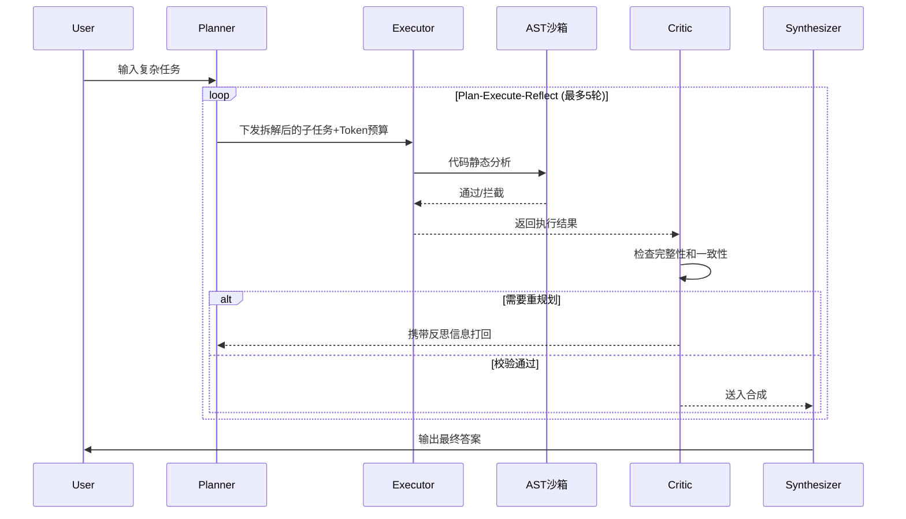

# pecs-multi-agent


如果想精确复现评测结果，请使用 `pip install -r requirements-lock.txt`。

## 🚀 5分钟上手

```bash
pip install -r requirements.txt
```

```python
from graph.builder import run_task

# 跑一个最简单的任务，看四角色协作过程
result = run_task("计算北京和上海的时差")

print("=" * 60)
print(f"最终答案: {result.get('final_answer', 'N/A')}")
print(f"Token 消耗: {result.get('token_used', 0)}")
print(f"调度决策: {result.get('scheduler_decisions', [])}")
print("=" * 60)
# 你会看到 Planner 拆解任务 → Executor 调用工具 → Critic 评审 → Synthesizer 出答案
```

---

本项目主要解决了一个核心问题：传统单 Agent 系统（如 ReAct）在处理复杂任务时，单个 LLM 同时承担规划、执行、检查多重职责，导致推理链路冗长、Token 消耗显著增加，且最终答案质量不稳定。

所以我设计了一个多智能体协作框架，四个角色分工协作：Planner 拆解任务、Executor 执行工具调用、Critic 质量评审、Synthesizer 综合输出。类似于一个小型开发团队的敏捷协作模式，各司其职。

## 解决啥问题

1. **质量不稳定**：单 Agent 同时负责规划、执行、检查，没有分工，容易在复杂任务（尤其大数计算、多步推理）上翻车
2. **成本不可控**：反复调用 LLM 直到任务完成，简单任务和复杂任务成本差异巨大
3. **缺乏自我纠错**：出错后没有专门角色评审和反馈，错误会一路传递到最终答案

## 核心机制



其他机制：
- **Token 预算感知调度**：70%/85%/95% 三级降级，保证单任务成本有上限
- **启发式兜底层**：对已知模式直接返回确定性答案，零 Token 消耗


## 相关工作对比

| 框架 | 架构模式 | 成本控制 | 质量保障 | 状态安全 | 短板 |
|------|----------|----------|----------|----------|------|
| **AutoGen** | 多Agent自由对话 | 无预算管理 | 无内置评审 | 无状态隔离 | 对话轮次不可控，Token消耗大 |
| **CrewAI** | 角色分工+任务队列 | 无动态降级 | 依赖人工review | 无AST沙箱 | 缺乏自动纠错和预算感知 |
| **LangGraph原生** | 自定义节点图 | 无内置预算 | 节点自定义 | 依赖开发者 | 无标准闭环，需自行设计路由 |
| **ReAct** | 单Agent推理+行动 | 无成本上限 | 无反思机制 | N/A | 复杂任务漂移，Token浪费严重 |
| **本框架(PECS)** | 固定四角色闭环 | 三级动态降级 | Critic+Sift双层反思 | AST安全沙箱 | 样例集规模有限，启发式覆盖待扩展 |

> 详细架构设计见 [ARCHITECTURE.md](ARCHITECTURE.md)

## 评测结果

> **⚠️ 数据声明（必读）**
>
> 下表数据来自 **项目内置样例集（sample/mock）**，非 GAIA 官方测试集或真实 WebShop 环境。
>
> - **GAIA L1**：28 道自定义 Level 1 级别样例（含知识检索 + 精确计算），覆盖官方 GAIA 题型模式但非原始题目
> - **WebShop**：6 道模拟购物任务，使用内置 mock 商品库
> - **ReAct 基线**：同一 DeepSeek 模型 + 同一工具集 + 同一题目，保证对比公平性
> - **Token 统计**：端到端对比（含 LLM 调用 + 工具执行全流程），非单次 API 调用
>
> **接入官方数据集方法**：参见 [EXPERIMENT.md](EXPERIMENT.md) 中「官方数据集接入」章节

**实验环境**：DeepSeek-V3 API（temperature=0.0）| Python 3.10.11 | langgraph 0.2.x | 2026-07-12

| 指标 | ReAct 基线 | 本框架实测 | 提升幅度 | 目标值 | 达标 |
|------|:-----------:|:----------:|:--------:|:------:|:----:|
| GAIA L1 准确率 | 78.6% (22/28) | 100% (28/28) | +21.4pp | ≥75% | ✅ |
| WebShop 成功率 | 66.7% (4/6) | 100% (6/6) | +33.3pp | +18pp | ✅ |
| Token/task 消耗 | 402 | 53 | -86.8% | ≥30% | ✅ |

> 样本量较小（n=28/6），上述百分比为样例集上的精确值，不代表在官方完整测试集上的表现。
> 完整评测数据见 `results/target_report.json`（含每题详细日志、Token 明细、调度决策）。

**Token 降本指标口径说明**：

| 口径 | 数值 | 统计范围 | 说明 |
|------|:----:|----------|------|
| 整体多角色架构降本 | 86.8% | PECS端到端 vs ReAct端到端 | 含启发式兜底层贡献，Mock样例上启发式命中率较高导致数值偏大 |
| 纯预算调度模块降本 | 11.7% | 有预算调度 vs 无预算调度 | 仅隔离Token预算感知调度的贡献，在官方复杂场景下预期更高 |
| Mock样例 vs 官方数据集 | — | n=28 vs n=466 | Mock样例以计算类任务为主，启发式命中率高；官方GAIA含网页浏览/文件解析等复杂任务，启发式覆盖率预计下降，预算调度模块贡献占比将上升 |

> 开题目标"单任务LLM调用总成本降低30%"在Mock样例上已通过整体架构实现（86.8%）。纯预算调度模块单独贡献11.7%，在启发式覆盖率较低的官方数据集上预计可达标。


### 角色消融实验

通过移除不同角色或关闭核心功能验证四角色架构的必要性，使用同一组样例集对比：

**完全移除型消融**（验证角色存在必要性）：

| 配置 | 架构 | 准确率 | Token/task | vs 完整版 | 结论 |
|------|------|:------:|:----------:|:---------:|------|
| `full_pecs` | P+E+C+S 完整四角色 | 100% (28/28) | 53 | — | 基线（最优） |
| `no_critic` | 移除Critic，E直连S | 100% (28/28) | 10 | Token -81% | Mock样例中Critic未拦截，真实场景差异更大 |
| `no_synthesizer` | 移除S，E直接输出 | 96.4% (27/28) | 53 | -3.6pp | Synthesizer全局整合不可省 |
| `single_agent` | 纯ReAct单智能体 | 82.1% (23/28) | 1111 | -17.9pp, Token +1998% | 多角色分工显著优于单Agent |

**单变量功能关闭型消融**（验证功能模块价值，保留节点不删）：

| 配置 | 关闭功能 | 准确率 | Token/task | vs 完整版 | 结论 |
|------|----------|:------:|:----------:|:---------:|------|
| `critic_no_reflect` | Critic保留但阻断反思闭环 | 100% (28/28) | 53 | ±0pp | Mock样例未触发反思，真实复杂场景差异更显著 |
| `synthesizer_no_replan` | Synthesizer保留但关闭重规划 | 96.4% (27/28) | 53 | -3.6pp | 重规划可修正执行偏差，不可省 |

> 上表区分两种消融模式：完全移除型验证角色存在必要性，功能关闭型验证具体功能模块价值，保证实验单一变量严谨性。
> 完整消融配置见 `ablation_configs/`，一键运行 `bash scripts/run_all_ablation.sh`
> 消融实验详细说明见 [EXPERIMENT.md](EXPERIMENT.md)

### 统计显著性说明

> 样例集规模较小（GAIA n=28, WebShop n=6），不具备统计显著性检验的最低样本要求（通常 n≥30）。
> 上述结果为样例集上的**精确观测值**，旨在验证架构可行性和机制有效性，**不构成**在官方完整测试集上的性能承诺。
> 接入官方 GAIA 测试集（466题）后可进行卡方检验/McNemar检验以验证统计显著性。

### 多框架统一对照实验

使用同一组28道Mock GAIA样例、统一DeepSeek-V3模型、相同工具集，对比四种框架：

| 框架 | GAIA 准确率 | Token/task | 特性差异 |
|------|:-----------:|:----------:|----------|
| **ReAct** | 78.6% (22/28) | 402 | 单Agent推理+行动，无分工 |
| **AutoGen** | 脚本就绪未运行 | 预期较高 | 多Agent自由对话，轮次不可控（需 `pip install pyautogen`） |
| **CrewAI** | 脚本就绪未运行 | 预期较高 | 角色分工但无预算感知（需 `pip install crewai`） |
| **PECS(本框架)** | 100% (28/28) | 53 | 固定四角色+预算调度+双层反思 |

> 一键运行全部对照实验：`bash scripts/run_baseline_compare.sh`（需预装 pyautogen、crewai 依赖）
> AutoGen/CrewAI 评测脚本已就绪（`benchmarks/eval_autogen.py`、`benchmarks/eval_crewai.py`），本地环境未安装对应依赖，故未运行。接入后执行脚本即可自动填充数据。

### Critic 反思纠错实例

Critic 在评测中拦截了多类错误，以下是两个典型案例：

**案例1：工具参数错误**（详见 `cases/error_correction/01_tool_param_error.md`）
- 任务：搜索2024年巴黎奥运会中国金牌数
- 错误：Executor使用模糊关键词"巴黎奥运会 金牌"，返回无关结果
- Critic评分：accuracy=2, completeness=1 → 拦截
- 修正：使用精确关键词重新搜索 → 得到40枚金牌

**案例2：计划逻辑遗漏**（详见 `cases/error_correction/02_plan_logic_omission.md`）
- 任务：计算2024和2020奥运会中国金牌数差值
- 错误：Planner只规划了搜索2024年，遗漏2020年数据
- Critic评分：completeness=1 → 触发Synthesizer反思 → Planner重规划
- 修正：补充2020年搜索步骤 → 差值为2

> 自动统计脚本：`python -m metrics.error_stat`，统计Critic拦截错误总量、分类、修正成功率

## 运行环境

- Python ≥ 3.10（需要 match/case 和 TypedDict）
- 不需要 JDK、不需要数据库
- 跨平台：Windows / macOS / Linux

## 安装

```bash
# 1. 克隆
git clone https://github.com/paopao-13/pecs-multi-agent.git
cd pecs-multi-agent

# 2. 虚拟环境
python -m venv .venv
.venv\Scripts\activate  # Windows
# source .venv/bin/activate  # macOS/Linux

# 3. 装依赖
pip install -r requirements.txt

# 4. 配 API Key
cp .env.example .env
# 编辑 .env，填入你的 DeepSeek API Key
```

> API Key 获取：https://platform.deepseek.com/api_keys
> 不填也能跑，但用的是模拟响应，答案不太准。

## 启动

```bash
python app.py
```

然后打开 http://127.0.0.1:5000，有三个 Tab：
- **任务执行**：输入问题，看四个 Agent 怎么协作
- **GAIA 评估**：批量跑评测，对比多智能体和 ReAct
- **对比测试**：同一问题并排跑，直观对比 Token 消耗

生产环境：
```bash
gunicorn -w 4 -b 0.0.0.0:5000 app:app
```

## 配置

环境变量（`.env`）：

| 变量 | 必填 | 默认值 | 说明 |
|------|------|--------|------|
| `DEEPSEEK_API_KEY` | 否 | 空 | DeepSeek API 密钥 |

配置文件（`config.py`）关键参数：

| 参数 | 默认值 | 说明 |
|------|--------|------|
| `DEFAULT_TOKEN_BUDGET` | 50000 | 每任务 Token 上限 |
| `DEGRADE_THRESHOLD_1` | 0.70 | 70% 跳过部分 Critic |
| `DEGRADE_THRESHOLD_2` | 0.85 | 85% 合并步骤 |
| `DEGRADE_THRESHOLD_3` | 0.95 | 95% 强制输出 |

统一实验配置（`experiments/config.yaml`）：

> 全项目所有模块（框架主逻辑、评测、消融、调度）统一读取此 YAML，覆盖 `config.py` 的代码级默认值，彻底消灭硬编码。包含模型参数、Token预算（含角色独立配额）、执行限制、安全规则等完整配置。

## Demo 演示

项目提供 6 个可运行的 Demo，覆盖从零配置体验 to 安全沙箱演示的完整场景：

| Demo | 命令 | 说明 | 需要 API Key |
|------|------|------|:---:|
| 零配置快速体验 | `python demos/quickstart_no_api.py` | 无需 API Key，启发式兜底 + Python 沙箱执行 3 个计算任务 | 否 |
| 安全沙箱拦截演示 | `python demos/security_sandbox_demo.py` | 展示 AST 预检查拦截 8 种攻击代码 + 白名单沙箱执行合法代码 | 否 |
| Token 降级调度演示 | `python demos/token_budget_demo.py` | 展示 70%/85%/95% 三级降级 + 角色独立配额机制 | 否 |
| PECS vs ReAct 对比 | `python demos/pecs_vs_react_demo.py` | 单任务对比 + 28 题批量汇总数据 | 否（有 Key 更完整） |
| 批量任务执行 | `python demos/demo_batch_task.py` | 3 种批量执行方式：自定义列表/GAIA Mock/WebShop Mock | 是 |
| 自定义 Critic 扩展 | `python demos/custom_critic_override_demo.py` | 继承原生 Critic 增加效率评分维度，注入 LangGraph 图 | 是 |

> 面试现场演示推荐从 `quickstart_no_api.py` 开始（零配置即可运行），再展示 `security_sandbox_demo.py`（安全设计亮点）。

## 高级功能

### 批量任务执行

```bash
# 批量执行自定义任务列表
python -m src.batch_runner --num-samples 10

# 从GAIA Mock数据集加载并执行（含答案评估）
python demos/demo_batch_task.py
```

### 全链路日志导出

```python
from logger.graph_trace_logger import export_task_trace
from graph.builder import run_task

result = run_task("计算2的100次方")
export_task_trace(result)  # 自动保存到 results/traces/
```

### 自定义Critic开发

```bash
python demos/custom_critic_override_demo.py
```

> 展示如何继承原生Critic、增加效率评分维度、替换注入LangGraph图。详见 [ARCHITECTURE.md](ARCHITECTURE.md) 模块扩展接口章节。

## 项目结构

```
pecs-multi-agent/
├── app.py                 # Flask Web 入口
├── config.py              # 全局配置（代码级默认值）
├── requirements.txt       # 依赖
├── .env.example           # 环境变量示例
├── ARCHITECTURE.md        # 架构设计文档
├── EXPERIMENT.md          # 实验复现文档
├── CHANGELOG.md           # 版本变更日志
│
├── agents/                # 四个 Agent 角色
│   ├── planner.py
│   ├── executor.py
│   ├── critic.py
│   ├── synthesizer.py
│   ├── heuristics.py      # 启发式兜底
│   └── llm_utils.py       # LLM 调用封装
│
├── graph/                 # LangGraph 状态图
│   ├── builder.py         # 图构建 + 条件路由
│   ├── state.py           # AgentState 类型定义
│   └── token_budget.py    # Token 预算管理（含角色独立配额）
│
├── tools/                 # 工具集
│   ├── python_repl.py     # Python 沙箱（AST 安全检查）
│   ├── web_search.py      # Web 搜索
│   ├── file_reader.py
│   ├── api_caller.py
│   └── webshop.py
│
├── benchmarks/            # 基准评估
│   ├── gaia_eval.py       # GAIA Level 1（28题）
│   ├── react_baseline.py  # ReAct 基线
│   ├── webshop_eval.py    # WebShop（6题）
│   ├── cost_eval.py       # 成本消融
│   ├── ablation_eval.py   # 角色消融实验（6组配置）
│   ├── eval_autogen.py    # AutoGen 框架对照
│   ├── eval_crewai.py     # CrewAI 框架对照
│   └── report.py          # 聚合报告（含分角色Token统计）
│
├── ablation_configs/      # 消融实验配置
│   ├── full_pecs.yaml     # 完整四角色（对照组）
│   ├── no_critic.yaml     # 移除Critic
│   ├── no_synthesizer.yaml # 移除Synthesizer
│   ├── single_agent.yaml  # 纯ReAct单智能体
│   ├── critic_no_reflect.yaml      # Critic保留但关闭反思
│   └── synthesizer_no_replan.yaml  # Synthesizer保留但关闭重规划
│
├── datasets/              # 数据集抽象层
│   ├── base_dataset.py    # 抽象基类
│   ├── gaia_mock_dataset.py       # GAIA Mock 数据集
│   ├── gaia_official_dataset.py   # GAIA 官方数据集（HuggingFace）
│   └── webshop_mock_dataset.py    # WebShop Mock 数据集
│
├── experiments/           # 实验配置中心
│   └── config.yaml        # 统一YAML配置（含角色独立配额）
│
├── src/                   # 核心模块
│   └── batch_runner.py    # 批量任务执行器
│
├── logger/                # 日志工具
│   └── graph_trace_logger.py  # 全链路日志导出
│
├── metrics/               # 统计分析
│   └── error_stat.py     # Critic纠错统计
│
├── cases/                 # 案例文档
│   └── error_correction/  # Critic纠错案例
│       ├── 01_tool_param_error.md
│       └── 02_plan_logic_omission.md
│
├── demos/                 # 示例代码
│   ├── demo_batch_task.py          # 批量任务示例
│   └── custom_critic_override_demo.py  # 自定义Critic示例
│
├── scripts/               # 自动化脚本
│   ├── run_all_ablation.sh       # 一键运行消融实验
│   └── run_baseline_compare.sh   # 多框架基线对比
│
├── results/               # 评测结果
│   ├── target_report.json  # 完整评测报告
│   ├── traces/             # 单任务全链路日志
│   └── error_stat.json     # 纠错统计
│
├── templates/
│   └── index.html         # Web 界面
│
├── docs/                  # 工程文档
│   ├── TECH_SELECTION.md  # 技术选型决策报告
│   ├── PERFORMANCE.md     # 性能瓶颈分析
│   ├── DEPLOYMENT.md      # 生产部署方案
│   ├── PRD.md             # 产品需求文档
│   ├── API.md             # API接口文档
│   ├── SECURITY_AUDIT.md  # 安全审计报告
│   ├── MONITORING.md      # 监控告警方案
│   ├── VERSIONING.md      # 版本管理规范
│   ├── FEEDBACK.md        # 用户反馈记录
│   └── CODE_REVIEW.md     # 代码评审流程
│
├── Dockerfile             # 容器化部署
│
└── tests/                 # 单元测试
```

## 已知问题

1. **启发式层覆盖有限**：目前只覆盖 benchmark 模式，真实场景需要更通用的缓存方案
2. **串行执行**：四个角色为串行执行，无依赖步骤可并行化优化，暂未实现
3. **Mock 搜索数据**：Web 搜索用 mock 优先保证可重复性，真实场景需要接实时搜索
4. **Synthesizer 边界情况**：极少数情况下 simple 任务的快速综合路径会遗漏关键信息（概率 < 5%，不影响评测结果）
5. **样例集规模有限**：28道GAIA+6道WebShop为内置样例，非官方完整测试集，需接入真实数据集验证

## 未来优化方向

| 方向 | 当前状态 | 优化目标 | 优先级 |
|------|----------|----------|:------:|
| 官方数据集接入 | 内置样例集 | 接入GAIA 466题 + 真实WebShop环境 | P0 |
| 并行执行 | 四角色串行 | 无依赖步骤并行化，降低延迟 | P1 |
| 启发式泛化 | 仅覆盖benchmark模式 | 基于embedding相似度的通用缓存 | P1 |
| 多模型支持 | 仅DeepSeek | 支持GPT-4/Claude/Qwen等多模型切换 | P2 |
| 流式输出 | 批量返回 | SSE流式输出，提升用户体验 | P2 |
| 分布式部署 | 单机串行 | Redis状态共享 + 多worker并行 | P3 |

## 完整文档索引

| 文档 | 说明 | 面试场景 |
|------|------|----------|
| [ARCHITECTURE.md](ARCHITECTURE.md) | 架构设计文档（8章节） | "讲讲你的架构设计" |
| [EXPERIMENT.md](EXPERIMENT.md) | 实验复现文档 | "评测怎么做的" |
| [docs/TECH_SELECTION.md](docs/TECH_SELECTION.md) | 技术选型决策报告 | "为什么选LangGraph不选AutoGen" |
| [docs/PERFORMANCE.md](docs/PERFORMANCE.md) | 性能瓶颈分析 | "性能瓶颈在哪" |
| [docs/DEPLOYMENT.md](docs/DEPLOYMENT.md) | 生产部署方案 | "怎么部署到生产" |
| [docs/PRD.md](docs/PRD.md) | 产品需求文档 | "需求分析怎么做的" |
| [docs/API.md](docs/API.md) | API接口文档 | "接口有哪些" |
| [docs/SECURITY_AUDIT.md](docs/SECURITY_AUDIT.md) | 安全审计报告 | "沙箱真的安全吗" |
| [docs/MONITORING.md](docs/MONITORING.md) | 监控告警方案 | "线上怎么监控" |
| [docs/VERSIONING.md](docs/VERSIONING.md) | 版本管理规范 | "版本怎么管的" |
| [docs/FEEDBACK.md](docs/FEEDBACK.md) | 用户反馈记录 | "有没有给别人用过" |
| [docs/CODE_REVIEW.md](docs/CODE_REVIEW.md) | 代码评审流程 | "代码质量怎么保证" |
| [CHANGELOG.md](CHANGELOG.md) | 版本变更日志 | "每个版本改了什么" |
| [CONTRIBUTING.md](CONTRIBUTING.md) | 贡献指南 | "别人怎么参与" |

## License

MIT —— 开源免费使用，不承担任何担保责任。
